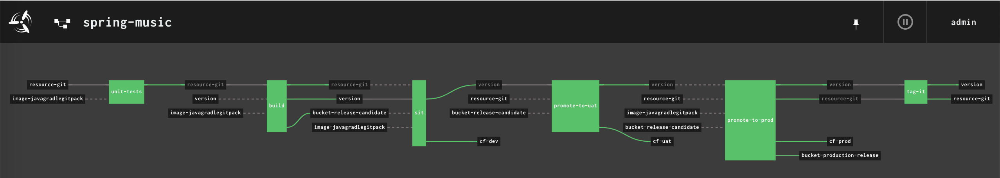

# Spring-music With [Concourse](https://concourse-ci.org/) Pipeline




The pipeline here includes some typical jobs we may have in real world CI/CD:

1. unit tests
2. build
3. SIT
4. promote to uat
5. promote to prod
6. tag it in repo 


## Preparation

### Concourse

You must have a running Concourse instance.

Simply spin up one by refering to Concourse's installation guide [here](https://concourse-ci.org/install.html)

### Git Repo

You should folk this repo to yours so that you have `write` permission for step 6 to have a complete CI/CD story.

It's just one click away so just do it.

### S3 

You can use any S3 compatible service to host the artifacts.

There are 3 configureable buckets we're going to use in the pipeline:
- version
- release-candidates
- releases

If you're using S3, you can do something like this:

```sh
$ mc mb local/version
$ mc mb local/release-candidates
$ mc mb local/releases
```

### The vars file for pipeline

I've provided a sample vars file [ci/pipeline-vars.yml](ci/pipeline-vars.yml).

You shall copy it out and change the settings accordingly.

### (optional) Secure credentials by CredHub 

While preparing vars file, you may have found that you have to take care of some credentials.

So if your Concourse have any credential management (e.g. CredHub, Vault) integrated, remember to secure your credentials.

For example, I use CredHub to secure my credentials:

```sh
$ credhub set -n /concourse/dev/pws_password -t password
$ credhub set -n /concourse/dev/minio_password -t password
$ credhub set -n /concourse/dev/github_private_key -t ssh --private ~/.ssh/id_rsa
```

## `fly` the pipeline

Now you can just `fly` the pipeline:

```
$ fly -t dev set-pipeline -p spring-music -c ci/pipeline.yml -l ci/pipeline-vars.yml
```

> Note the Concourse `team` I'm using here is `dev`, you MUST change to yours accordingly.
